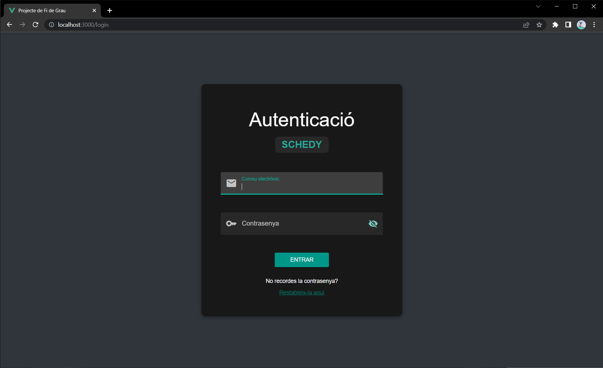
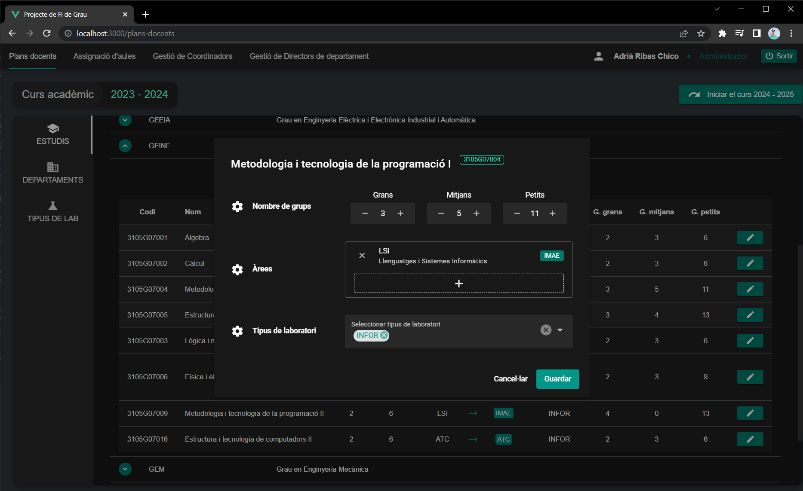
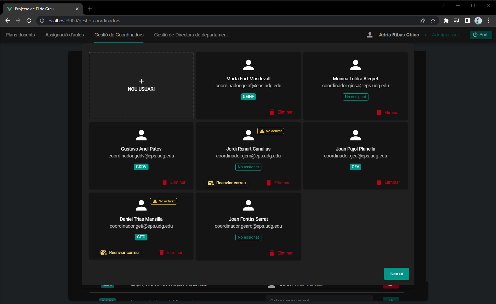
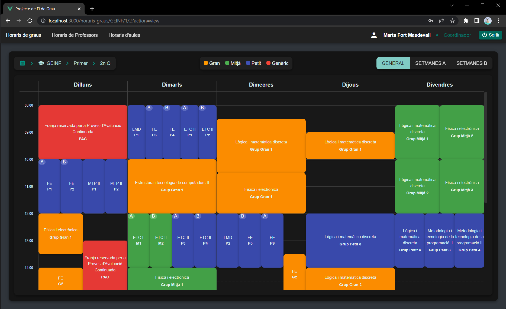
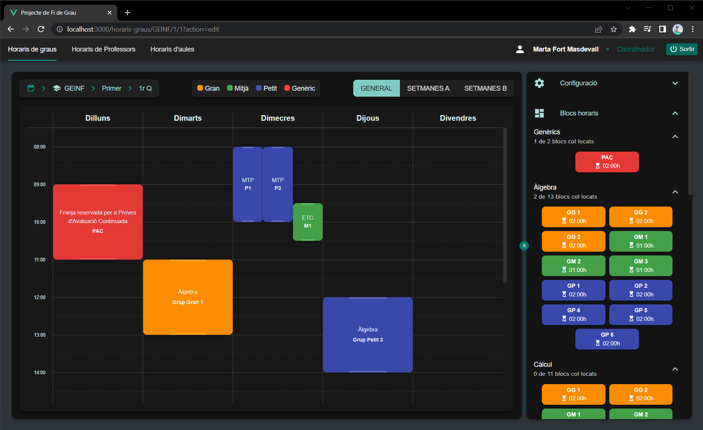
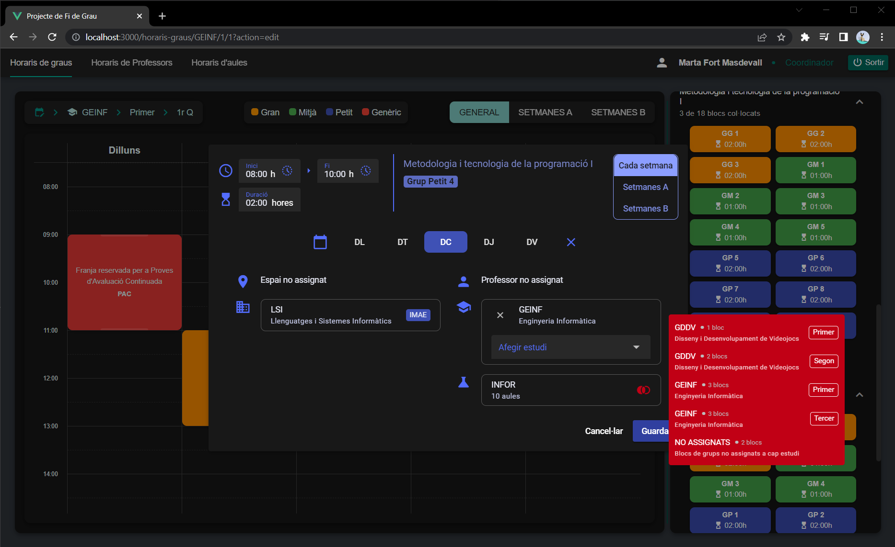
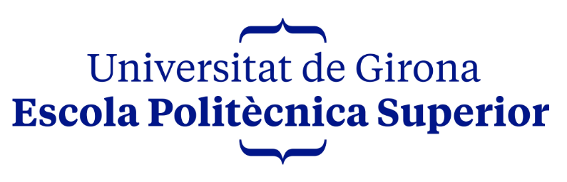

# Schedule management application

> Bachelor thesis - Computer Engineering  
> [Full documentation](https://github.com/adriribas/pfg-documentation/raw/main/documentation.pdf)

## Goal

The purpose of this project is to provide a useful tool to maintain the schedules of all the degrees, professors and classrooms of my university. It must be customized and must perfectly fit the university's use cases.

The developed software has to be a **full-stack** web application which main goals and features are:

- Attractive, comfortable, intuitive and efficient user interfaces
- View and modify the schedules of each degree, as well as of each professor and classroom
- Automatic detection of time overlaps and incompatibilities
- Role-based users system

## Used technologies

### Back-end

- Database: [MySQL](https://www.mysql.com/)
- Environment: [Node.js](https://nodejs.org/)
- Framework: [Express](https://expressjs.com/)
- ORM: [Sequelize](https://sequelize.org/)

### Front-end

- Build tool: [Vite](https://vitejs.dev/)
- Framework: [Vue](https://vuejs.org/)
- Additional libraries: [Pinia](https://pinia.vuejs.org/), [Vue Router](https://router.vuejs.org/), [Quasar](https://quasar.dev/)

## Application Screenshots

### Auth

### Data maintenance

### User management

### Schedule

### Schedule modification

### Overlaping info

---
 

  

